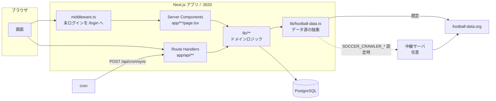
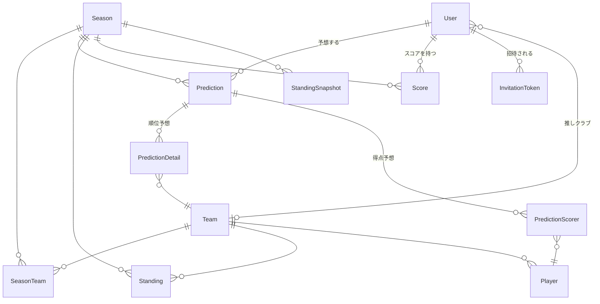
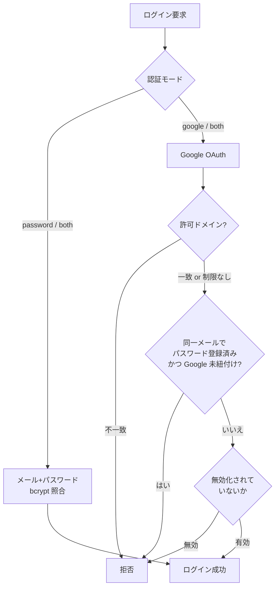

# 構成

Next.js (App Router) の単一アプリ。サーバコンポーネントから直接 Prisma を叩き、
外部データは1つの層に集約している。特別なミドルウェアやジョブキューは無い。

---

## 全体像



**外部アクセスは `lib/football-data.ts` を必ず通る。**
上流のレート制限（10リクエスト/分）をここで受けているため、
別の場所に `fetch` を書くとキャッシュとレート制御を素通りする。

---

## ディレクトリ

| パス | 役割 |
|---|---|
| `app/` | 画面（`page.tsx`）と API（`api/**/route.ts`） |
| `components/` | 画面部品 |
| `lib/` | ドメインロジック。DB アクセスと純粋関数 |
| `prisma/` | スキーマとマイグレーション |
| `scripts/` | 初期投入・cron・開発用ツール |
| `__tests__/` | vitest。純粋ロジック中心 |
| `docs/` | このドキュメント一式 |

### lib の主なファイル

| ファイル | 責務 |
|---|---|
| `football-data.ts` | **上流データ源の抽象**。fd 直叩き / Hub 経由を切り替え、正規化して返す |
| `league-data.ts` | 得点ランキングなど「現実のリーグの事実」。TTL キャッシュを被せる |
| `players.ts` | 得点予想の候補選手。スカッド取得と `Player` への反映 |
| `season-sync.ts` | 同期の本体（チーム → 順位表 → スナップショット → スコア再計算） |
| `scoring.ts` | 順位予想のスコア計算（純粋関数） |
| `scorer-total.ts` | 得点予想の集計とランキング組み立て |
| `season-visibility.ts` | 誰の何をいつ見せるか（ネタバレ防止） |
| `auth.ts` / `auth-config.ts` / `auth-policy.ts` | 認証。設定解決・ポリシー判定・NextAuth 設定 |
| `secret-box.ts` | Google シークレットの暗号化（AES-256-GCM） |
| `site-config.ts` | サイト設定（シングルトン行） |
| `ttl-cache.ts` | プロセス内 TTL キャッシュ |

**テストしやすさのために純粋ロジックを分けてある。**
`scoring.ts` / `season-visibility.ts` / `auth-policy.ts` / `admin-users.ts` は
DB もネットワークも触らないので、そのまま単体テストできる。

---

## 画面

| パス | 内容 | 認証 |
|---|---|---|
| `/` | 入口 | 不要 |
| `/login` `/register` `/invite/[token]` | ログイン・登録・招待受け取り | 不要 |
| `/home` | ダッシュボード | 要 |
| `/predict` | 順位予想・得点予想の入力 | 要 |
| `/ranking` | 現在のランキング | 要 |
| `/ranking/archive` | 確定済みシーズン | 要 |
| `/ranking/[userId]` | 個人の予想詳細 | 要 |
| `/results` | 試合結果 | 要 |
| `/league` | リーグの実データ（得点ランキングなど） | 不要 |
| `/stats` `/stats/timeline` | 的中率・順位推移 | 要 |
| `/profile` | 表示名・推しクラブ・パスワード変更 | 要 |
| `/admin` 配下 | シーズン / ユーザー / サイト設定 / 認証設定 | 要（管理者） |

保護は [middleware.ts](../middleware.ts) の matcher で指定している。
管理者判定は各 API・画面で `session.user.isAdmin` を見る。

---

## API

| メソッド・パス | 用途 |
|---|---|
| `POST /api/cron/sync` | **自動同期**。`Authorization: Bearer $CRON_SECRET` |
| `POST /api/admin/sync` | 手動同期（管理者） |
| `GET POST /api/admin/seasons`, `PATCH DELETE /api/admin/seasons/[id]` | シーズン管理 |
| `GET POST /api/admin/users`, `PATCH DELETE /api/admin/users/[id]` | ユーザー管理・招待発行 |
| `GET PUT /api/admin/site-config` | サイト設定 |
| `GET PUT /api/admin/auth-config` | 認証設定 |
| `GET POST /api/predictions` | 順位予想 |
| `GET POST /api/predictions/scorers` | 得点予想 |
| `GET /api/standings` `/api/teams` `/api/players` `/api/matches` `/api/seasons` | 参照系 |
| `GET /api/stats/accuracy` `/timeline` `/compatibility` | 統計 |
| `POST /api/register` `/api/invite/[token]` | 登録・招待受け取り |
| `PATCH /api/user/profile` `/api/user/password` | 本人設定 |
| `/api/auth/[...nextauth]` | NextAuth |

---

## データモデル



| テーブル | 役割 |
|---|---|
| `SiteConfig` | サイト設定。`id="singleton"` の1行だけ |
| `Season` | シーズン（リーグ × 年）。締切2種・ロック・結果開示フラグを持つ |
| `Prediction` | 1人1シーズンの予想。`@@unique([userId, seasonId])` |
| `PredictionDetail` | 順位予想の中身（チーム × 予想順位） |
| `PredictionScorer` | 得点予想の指名（最大3枠） |
| `Standing` | 現在の順位表（同期で上書き） |
| `StandingSnapshot` | 節ごとの順位。順位推移グラフの元データ |
| `Score` | 計算済みスコア。同期のたびに再計算 |
| `Player` | 得点予想の候補選手。スカッド同期で upsert |
| `Account` `Session` `VerificationToken` | NextAuth 標準 |

### 設計上の決めごと

- **`Team.apiTeamId` は上流のチームID**。ここが上流とズレると順位表と紐付かない。
  Hub 経由でも上流の ID（`fd_id`）を優先して保存する。
- **`Player` は upsert のみで削除しない**。移籍で外れた選手を消すと、
  その選手を指名済みの予想が壊れるため。
- **`PredictionScorer.pickedTeamId`**: 上流が移籍前後の両クラブに同じ選手を載せることがあり、
  `Player.teamId` は「最後に同期したクラブ」になってしまう。
  指名時に見えていたクラブを別に持って、表示がぶれないようにしている。
- **順位予想と得点予想はスコアを合算しない**。別の競技として扱う。

---

## 認証



### 設定の解決順

**DB（`SiteConfig`）が優先、未設定なら環境変数**（`lib/auth-config.ts`）。

配布先が `.env` だけで起動できるようにしつつ、起動後は管理画面から変えられるようにするため
この向きにしてある。逆向き（env 優先）にすると、画面で保存しても効かない設定ができてしまう。

DB 側に既定値を置いていないのも意図的。既定値を入れると、既存環境が
マイグレーション直後に認証方式を切り替えてしまい、管理者が締め出される。

### 乗っ取り防止

同じメールアドレスで「パスワード登録済み・Google 未紐付け」のアカウントがある場合、
Google ログインは**拒否**される。第三者が他人のアドレスで先に自己登録し、
本人の Google ログインを自分のアカウントへ引き込むのを防ぐため。

同じ理由で、`ALLOWED_EMAIL_DOMAIN` を設定している場合、そのドメイン宛の
自己登録は拒否して Google ログインへ誘導する。

### Google シークレットの保存

管理画面から入れたクライアントシークレットは、`NEXTAUTH_SECRET` から導出した鍵で
AES-256-GCM 暗号化して DB に入る。`NEXTAUTH_SECRET` を変えると復号できなくなり、
「未設定」として環境変数側にフォールバックする。

---

## キャッシュとレート制御

上流は 10リクエスト/分。3段で受けている。

| 層 | 実装 | 効き方 |
|---|---|---|
| リクエスト間隔 | `lib/football-data.ts` の直列キュー | 直叩き時、前回から 6.5 秒空ける |
| fetch キャッシュ | `next: { revalidate: 60 }` | 同一URLは 60 秒使い回す |
| TTL キャッシュ | `lib/ttl-cache.ts` | 得点ランキング 60 秒 / スカッド 10 分 |

加えて、スカッドは全20クラブを一括で取らず
「ユーザーがそのクラブを開いたときだけ取る」形にして自然に分散させている。

---

## テスト

```bash
npm test              # 全部
npm run test:coverage # カバレッジ
```

ネットワークと DB を必要としないものだけが常時走る。
上流との契約テスト（`football-data.contract.test.ts`）はキーがある環境でのみ実行され、
無ければ自動で skip される。
