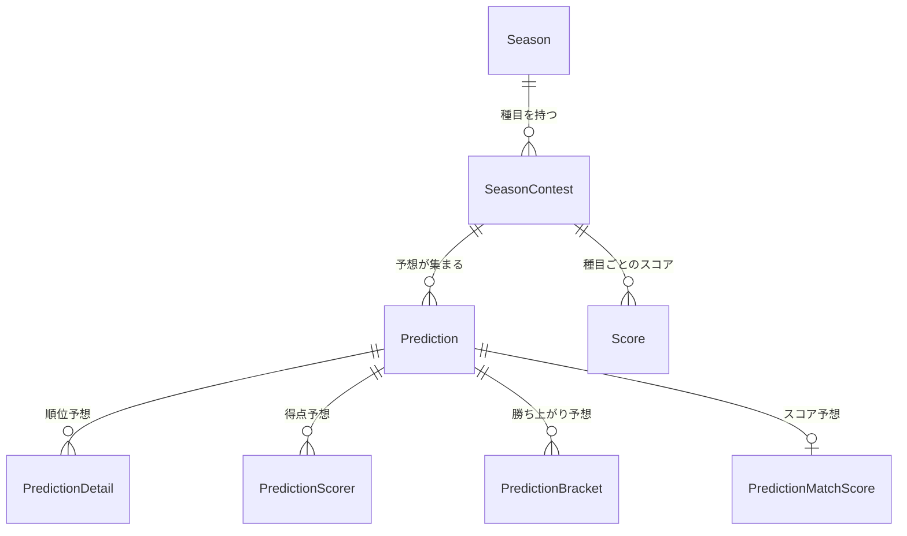

# 設計: 種目（Contest）と締切ルールの一般化

作成日: 2026-09-04 / 状態: **設計確定。実装中**

CL 対応は**ベータ**として出す（下記「ベータとしての出し方」）。

---

## 何を解くか

4つの要求が出た。どれも「シーズン＝1つの予想」という現在の前提に収まらない。

| # | 要求 | 現在できない理由 |
|---|---|---|
| 1 | CL リーグフェーズは「全チームが2試合消化したら締切」。節数は設定可能に | 締切が日時（`predictionDeadline`）1本しかない |
| 2 | シーズンの詳細画面がほしい。複数リーグが走ると一覧では締切を編集できない | 一覧行にインライン編集を詰め込んでいる |
| 3 | CL ノックアウトのブラケット予想。プレーオフ終了後に開始、緒戦キックオフ1時間前に締切 | 「開始日時」の概念が無い。キックオフ時刻を保存していない |
| 4 | CL 決勝のスコア予想。決勝キックオフ1時間前に締切 | 順位予想モデルに載らない別ゲーム |

共通しているのは **「1つのシーズンに、締切ルールの違う複数の種目がぶら下がる」** という形。
そこを構造にすれば4つとも同じ仕組みで解ける。

---

## 中心概念: 種目（Contest）

シーズンの下に**種目**を置く。種目は「1つの予想ゲーム」で、それぞれ独立した
開始時刻・締切・ルール・ランキングを持つ。



### 種目の種類

| 種類 | 内容 | 予想の中身 | 順位 |
|---|---|---|---|
| `table` | 順位予想（既存） | チーム × 予想順位 | 差の合計が小さいほど上位 |
| `scorer` | 得点予想（既存） | 選手3人 | 合計得点が多いほど上位 |
| `bracket` | 勝ち上がり予想（新規） | 各対戦カードの勝者 | 的中の合計点が多いほど上位 |
| `score` | スコア予想（新規） | 1試合の得点 | 的中の度合いで加点 |

**既存の「順位予想」「得点予想」もこの形に載せ替える。**
今は `Season` が `predictionDeadline` と `scorerDeadline` を直接持っているが、
これを種目2件に置き換える。特別扱いを残すと、種目を増やすたびに分岐が増える。

---

## 締切ルール

締切の決まり方を**3種類に閉じる**。自由な式にはしない（設定画面が作れなくなる）。

| ルール | 意味 | パラメータ | 使う場面 |
|---|---|---|---|
| `fixed` | 指定した日時 | 日時 | 各国リーグの順位予想（現行すべて） |
| `matchday` | 全チームがN試合を消化した時点 | N | CL リーグフェーズ（要求1。N=2 が既定、設定可） |
| `kickoff_minus` | 指定ステージの最初のキックオフのN分前 | ステージ, 分 | ブラケット（`LAST_16` / 60分前）、決勝スコア（`FINAL` / 60分前） |

**開始時刻（いつから登録できるか）も同じ3種類で表す。**
ブラケット予想の「プレーオフ終了後」は `matchday` では表せないので、4つ目を足す。

| ルール | 意味 | パラメータ | 使う場面 |
|---|---|---|---|
| `stage_finished` | 指定ステージの全試合が終了した時点 | ステージ | ブラケットの開始（`PLAYOFFS`） |

### `stage_finished` は「1件も無い」を終了と誤判定しない

「そのステージの全試合が FINISHED」を素直に書くと、**試合が1件も無いときに真になる**。
プレーオフの組み合わせ抽選前に同期したシーズンでは `PLAYOFFS` の行が存在しないので、
ブラケット予想が数か月早く開いてしまう。

**判定は「そのステージの試合が1件以上あり、かつ全てが FINISHED」とする。**

### 開始条件を満たしても、締切が解決できないうちは開かない

ブラケット予想は開始（プレーオフ終了後）と締切（ラウンド16の初戦60分前）が
別のタイミングで決まる。**ラウンド16の日程は、プレーオフ後の抽選で決まる。**
つまり「開始条件は満たしたが、締切がまだ `null`」という状態が必ず発生する。

**決め: 締切が解決できることを、受付開始の前提条件にする。**
この状態の種目は「日程確定待ち」と表示し、受付は始めない。
先に開けてしまうと、保存できない画面に人を通すことになる。

### なぜ「プレーオフ終了後」なのか

CL の新フォーマットでは、リーグフェーズ9〜24位がプレーオフを戦い、
勝った8チームがラウンド16へ入る。**リーグフェーズが終わっただけでは
ラウンド16の顔ぶれが決まらない。** だから開始はプレーオフ終了後になる。

---

## 締切リゾルバ

締切と開始時刻は**必ず1つの関数を通す**。今は `predictionDeadline` を8箇所以上で
直接読んでいて、ルールが増えると全部が壊れる。

```ts
export type DeadlineRule =
  | { kind: "fixed"; at: Date }
  | { kind: "matchday"; matchday: number }
  | { kind: "kickoff_minus"; stage: string; minutes: number }

export type OpenRule =
  | { kind: "fixed"; at: Date }
  | { kind: "stage_finished"; stage: string }

/**
 * 締切の実時刻を求める。
 * 解決できない（そのステージの日程がまだ出ていない等）場合は null。
 */
export function resolveDeadline(
  rule: DeadlineRule,
  ctx: { standings: MinimalStanding[]; matches: MatchSchedule[] }
): Date | null
```

### `null` の扱い（重要）

**解決できない締切は「締切済み」でも「無期限」でもない。** どちらに倒しても事故になる。

- 「締切済み」に倒す → 日程が出る前は誰も予想できない
- 「無期限」に倒す → 日程取得に失敗した瞬間、締切後でも予想を受け付けてしまう

**決め: `null` は「まだ受付を開始していない」として扱う。**
画面には「日程が確定したら受付を開始します」と出し、予想の保存は拒否する。
締切を過ぎているかもしれないものを受け付けるより、まだ始まっていないと言う方が安全。

### `matchday` 締切の判定

「全チームがN試合を消化した時点」は `Standing.played` の**最小値**で見る。
最大値ではない。1チームでも消化していなければ締め切らない
（試合の延期があると、チームごとに消化数がずれるため）。

締切の「時刻」は同期が走ったタイミングになるので厳密な瞬間ではない。
実運用では日次同期で足りるが、締切直前だけ同期間隔を詰める運用も選べるようにする。

**前提: `Standing.played` はリーグフェーズの消化数だけを数える。**
上流の順位表はリーグフェーズのものなので、プレーオフやラウンド16の試合は入らない。
`lib/leagues.ts` の `CL: totalMatchdays = 8` もこの前提に立っている。
ここが崩れると「全チームが2試合消化」が誤ったタイミングで真になる。

---

## 試合データを保存する（この設計で一番のコスト）

`kickoff_minus` と `stage_finished` は**試合日程が要る**。
現在 `fetchMatches` は呼ぶたびに上流へ取りに行き、**どこにも保存していない**。

締切判定のたびに上流を叩くのは危険。上流が落ちた瞬間に締切が解決できなくなり、
`null` の扱い（＝受付停止）に倒れて全員が予想できなくなる。

**`Match` テーブルを追加し、同期で保存する。**

```prisma
model Match {
  id            String   @id @default(cuid())
  seasonId      String
  apiMatchId    Int      @unique
  stage         String   // LEAGUE_STAGE / PLAYOFFS / LAST_16 / QUARTER_FINALS / SEMI_FINALS / FINAL
  matchday      Int?
  status        String   // SCHEDULED / FINISHED など
  utcDate       DateTime
  homeTeamId    String
  awayTeamId    String
  scoreHomeFt   Int?
  scoreAwayFt   Int?
  winner        String?  // HOME_TEAM / AWAY_TEAM / DRAW
  updatedAt     DateTime @updatedAt

  season   Season @relation(fields: [seasonId], references: [id])
  homeTeam Team   @relation("HomeMatches", fields: [homeTeamId], references: [id])
  awayTeam Team   @relation("AwayMatches", fields: [awayTeamId], references: [id])

  @@index([seasonId, stage])
}
```

CL の1シーズンは189試合。**1リクエストで全部取れる**ことは実測済み
（`/v4/competitions/CL/matches?season=2025` → LEAGUE_STAGE 144 / PLAYOFFS 16 /
LAST_16 16 / QUARTER_FINALS 8 / SEMI_FINALS 4 / FINAL 1）。
同期のリクエスト数は1シーズンあたり2 → 3 に増えるだけ。

これは締切のためだけでなく、ブラケット予想の対戦カードとスコア予想の対象試合、
`/results` の試合結果表示にも使う。

---

## スキーマ

### 追加: `SeasonContest`

```prisma
model SeasonContest {
  id        String   @id @default(cuid())
  seasonId  String
  /// "table" | "scorer" | "bracket" | "score"
  kind      String
  /// 画面に出す名前。未設定なら kind ごとの既定名
  label     String?

  /// 開始ルール。null なら「いつでも受付」
  openRule      String?  // "fixed" | "stage_finished"
  openAt        DateTime?
  openStage     String?

  /// 締切ルール
  deadlineRule  String   // "fixed" | "matchday" | "kickoff_minus"
  deadlineAt    DateTime?
  deadlineMatchday Int?
  deadlineStage String?
  deadlineMinutesBefore Int?

  /// 種目ごとの追加設定（枠数・配点など）。種類ごとに解釈が違う
  config    Json?

  /// 種目単位の有効/無効。シーズン側の isLocked が優先する（下記）
  isActive  Boolean  @default(true)
  createdAt DateTime @default(now())

  season      Season       @relation(fields: [seasonId], references: [id], onDelete: Cascade)
  predictions Prediction[]
  scores      Score[]

  @@unique([seasonId, kind])
}
```

ルールごとに使う列が違うので、**使わない列は null** にする。
1つの JSON 列にまとめないのは、締切の設定が管理画面のフォームと直結するため
（型が効かない JSON はフォームのバリデーションが書けない）。

### 変更: `Prediction` の一意制約（最も影響が大きい）

```prisma
// 現在
@@unique([userId, seasonId])

// 変更後
@@unique([userId, contestId])
```

1シーズンに4種目あるなら、1人あたり最大4件の `Prediction` を持つ。
**`Score` も同様に `contestId` 単位になる。**

この変更は `season-sync.ts`（スコア再計算）、ランキングの全クエリ、
統計3画面（的中率・推移・相性）に波及する。**この設計で最も侵襲的な部分。**

### 追加: 予想の中身（種目ごと）

```prisma
/// 勝ち上がり予想。1対戦カードにつき1行
model PredictionBracket {
  predictionId String
  /// LAST_16 / QUARTER_FINALS / SEMI_FINALS / FINAL
  stage        String
  /// 同じステージ内でのカードの並び順（1..8）
  slot         Int
  /// 勝ち上がると予想したチーム
  teamId       String

  prediction Prediction @relation(fields: [predictionId], references: [id], onDelete: Cascade)
  team       Team       @relation(fields: [teamId], references: [id])

  @@id([predictionId, stage, slot])
}

/// スコア予想。1予想につき1試合
model PredictionMatchScore {
  predictionId String @id
  matchId      String
  scoreHome    Int
  scoreAway    Int

  prediction Prediction @relation(fields: [predictionId], references: [id], onDelete: Cascade)
  match      Match      @relation(fields: [matchId], references: [id])
}
```

### 3つのフラグの優先順位

`Season.isLocked` / `Season.isActive` / `SeasonContest.isActive` が並ぶので、
食い違ったときの解釈を決めておく。

| 状態 | 種目はどうなるか |
|---|---|
| `Season.isLocked = true` | **種目の設定に関わらず全種目を締切扱い。** 確定済みシーズンは記録であって、あとから予想を入れられてはいけない |
| `Season.isActive = false` | 画面の一覧に出さない（非表示）。データは残る |
| `SeasonContest.isActive = false` | その種目だけ出さない。他の種目は動く |

### 既存列の扱い

`Season.predictionDeadline` と `Season.scorerDeadline` は
**移行後に削除する**。読み取り経路として残すと、種目側の締切と必ずずれる。

---

## 種目のルール

### ブラケット予想（`bracket`）

**予想するのは「試合」ではなく「対戦カード」。** ラウンド16は16試合あるが、
2レグ制なので**8カード**。ホーム&アウェイの2試合を1カードに束ねる。

| ステージ | カード数 |
|---|---|
| ラウンド16 | 8 |
| 準々決勝 | 4 |
| 準決勝 | 2 |
| 決勝 | 1 |
| **計** | **15** |

- 開始: プレーオフ全試合終了後（`stage_finished: PLAYOFFS`）
- 締切: ラウンド16の最初のキックオフ60分前（`kickoff_minus: LAST_16, 60`）
- 予想: 15カードそれぞれの勝ち上がりチームを選ぶ

**配点は勝ち上がるほど高くする**（設定可）。既定案:

| 的中したステージ | 点 |
|---|---|
| ラウンド16 | 1 |
| 準々決勝 | 2 |
| 準決勝 | 3 |
| 決勝（＝優勝的中） | 5 |

**要確認**: 準々決勝以降は「ラウンド16の予想が外れると、そもそも予想したチームが
勝ち上がっていない」状態が起きる。2通りある。

- **A案（推奨）**: 各ステージを独立に採点する。「準決勝に勝ち上がるチーム」を
  ブラケットの位置に関係なく当てれば加点。外れが連鎖しない
- **B案**: ブラケットを厳密に辿る。前のステージを外すと以降は自動的に不正解

A案の方が最後まで楽しめる。B案は本格的だが、序盤で外すと詰む。

### スコア予想（`score`）— 追加する価値はある

**判断: 追加してよい。** 理由は3つ。

1. **1試合だけなので参加のハードルが低い。** 選手やチームの知識が要らず、
   リーグフェーズに参加しなかった人も入れる
2. 締切がキックオフ1時間前なので、他の種目と完全に独立して運用できる
3. 決勝当日の盛り上がりに直接効く

**ただし部分点が必須。** 完全一致だけにすると、ほぼ全員が0点になって順位がつかない。
3段階にする（配点は設定可）。

| 的中の度合い | 例（実際が 2-1） | 点 |
|---|---|---|
| 完全一致 | 2-1 | 5 |
| 得失点差が一致（勝敗も一致） | 3-2 / 1-0 | 3 |
| 勝敗のみ一致 | 4-1 / 2-0 | 1 |
| 外れ | 1-2 / 0-0 | 0 |

**決め: スコアは `score.fullTime`（延長込み）を使い、PK戦は含めない。**
上流の `duration` が `PENALTY_SHOOTOUT` の試合でも、`fullTime` は延長終了時点の
スコアを返す。PKを含めると「1-1で終わってPKで決着」を何と予想すればいいか
決められなくなる。**この扱いはルール文書に明記する**（引き分けの決勝で必ず揉める）。

---

## 画面: シーズン詳細

現在の一覧は1行に「同期 / 結果開示 / 確定 / 非表示 / 締切のインライン編集」が
詰まっていて、複数リーグが並ぶと操作できない。**種目が増えるとさらに破綻する。**

### 一覧（`/admin/seasons`）— 減らす

行に残すのは**識別と状態、そして詳細への入口だけ**。

```
26-27  [受付中]  PL・2026年                          [同期] [詳細 →]
       チーム20 / 予想7 / 進行 2〜2節 / 38節
       種目: 順位予想（受付中）・得点予想（8/31締切）
```

- 名前・リーグ・年・状態バッジ
- 集計（チーム数・予想数・進行節）
- **種目の一覧を1行サマリで**（どの種目がいま受付中か）
- 同期ボタン（一覧から即実行できる価値があるので残す）
- 詳細へのリンク

**インライン締切編集（`startEditDeadline` / `saveDeadline`）は削除する。**
拡張ではなく削除。詳細画面に移す。

### 詳細（`/admin/seasons/[id]`）— 新規

```
← シーズン一覧

26-27（プレミアリーグ・2026年）              [非表示にする] [シーズン確定]

┌ 状態 ────────────────────────────────┐
│ 進行: 2〜2節 / 38節   チーム: 20   参加者: 7      │
│ 最終同期: 2026-09-04 03:10  [いま同期する]        │
│ ⚠ 警告 1件（前年の得点ランキングを取得できません） │
└────────────────────────────────────┘

┌ 種目 ───────────────────────  [+ 種目を追加] ┐
│                                                  │
│ 順位予想                              [受付中]   │
│   開始: 制限なし                                 │
│   締切: 2026-08-31 23:59  （日時指定）  [編集]   │
│                                                  │
│ 得点予想                              [締切済]   │
│   締切: 2026-09-07 23:59  （日時指定）  [編集]   │
│                                                  │
└──────────────────────────────────┘

┌ 結果の開示 ──────────────────────────┐
│ 最終節が完了すると押せます（現在 2/38節）        │
│ [結果を開示する]（無効）                          │
└────────────────────────────────────┘
```

CL のシーズンなら種目の欄はこうなる。

```
│ 順位予想（リーグフェーズ 上位8位）        [受付中]   │
│   締切: 全チームが 2 試合消化した時点（節数指定）    │
│         → 現在 1節。あと1節で締切          [編集]   │
│                                                     │
│ 勝ち上がり予想                          [開始前]    │
│   開始: プレーオフ終了後（現在 未終了）             │
│   締切: ラウンド16 の最初のキックオフ 60 分前       │
│         → 2027-03-10 20:00（日程確定済）   [編集]   │
│                                                     │
│ 決勝スコア予想                          [開始前]    │
│   締切: 決勝のキックオフ 60 分前                    │
│         → 日程未確定                       [編集]   │
```

**設計の要点**: 締切は「ルール」と「解決結果」を**両方出す**。
ルールだけだと管理者がいつ締まるか分からず、結果だけだとなぜその時刻なのか分からない。

### 締切の編集フォーム

ルールを選ぶとパラメータの欄が切り替わる。

```
締切の決め方
  ( ) 日時を指定          [2026-08-31 23:59]
  (•) 消化試合数で決める   全チームが [ 2 ] 試合を消化した時点
  ( ) キックオフ基準       [ラウンド16 ▾] の最初のキックオフ [ 60 ] 分前

→ 現在の見込み: 2026-09-30 頃（1節目終了時点）
```

**要確認**: 種目の追加はどこまで自由にするか。
`table` と `scorer` はリーグ定義（`lib/leagues.ts`）から自動で作られるべきで、
`bracket` と `score` は CL でだけ手動追加、という形が現実的だと考えている。
「シーズン作成時に種目を自動生成し、あとから追加・削除できる」を既定とする。

---

## 移行

既存データを壊さずに種目へ移す。

1. `SeasonContest` / `Match` / `PredictionBracket` / `PredictionMatchScore` を追加
2. **既存シーズンごとに種目を生成する**（データ移行スクリプト）
   - `table` 種目を1件作り、`deadlineRule="fixed"`, `deadlineAt=predictionDeadline`
   - `hasScorerPrediction` が true のリーグなら `scorer` 種目も作り、
     `deadlineAt = scorerDeadline ?? predictionDeadline`
3. 既存の `Prediction` を種目ごとに分ける
   - **元の行はそのまま `table` 種目に付け替える**（`id` を保つ）。
     `PredictionDetail` は `predictionId` で紐付いているので、行を作り直さなければ触らなくてよい
   - `PredictionScorer` を持つ予想については、**`scorer` 種目用の `Prediction` を新規に作り**、
     その `PredictionScorer` の `predictionId` を新しい行へ付け替える
   - 順序を守ること。`PredictionDetail` / `PredictionScorer` は
     `onDelete: Cascade` なので、元の行を先に消すと中身ごと消える
4. `Score` を `table` 種目に付け替える
   - **既存の `Score` は順位予想のスコアしかない。** 得点予想のスコアは
     指名と上流の得点から毎回計算していて保存されていないので、`scorer` 種目には
     引き継ぐ行が無い（同期で作られる）。1件の `Score` を2種目へ複製してはいけない
5. `Prediction` の一意制約を `[userId, contestId]` へ張り替え
6. `Season.predictionDeadline` / `scorerDeadline` を削除

**3が最も危険。** 現在 `Prediction` 1件に順位予想と得点予想が同居しているので、
分割で取りこぼすと予想が消える。移行前後で
「`PredictionDetail` の総数」「`PredictionScorer` の総数」「ユーザー×シーズンの組み合わせ数」を
突き合わせる検証を必ず入れる。本番適用の前に DB のバックアップを取ること。

---

## 実装の順番

依存関係があるので、この順でないと動かない。

| 段階 | 内容 | これ単体で価値があるか |
|---|---|---|
| 1 | `Match` テーブルと同期への組み込み | ○（試合結果の表示が上流依存でなくなる） |
| 2 | `SeasonContest` + 締切リゾルバ + 既存2種目の移行 | ○（要求1「節数で締切」がここで実現） |
| 3 | シーズン詳細画面 | ○（要求2） |
| 4 | ブラケット予想 | ○（要求3） |
| 5 | 決勝スコア予想 | ○（要求4） |

**段階2が山**。一意制約の変更でランキング・統計の全クエリに触る。
ここだけは他と混ぜずに、単独で通すこと。

---

## 決定事項

| # | 論点 | 決定 |
|---|---|---|
| 1 | ブラケットの採点 | **ステージ独立（A案）**。前のステージを外しても以降が自動的に不正解にならない |
| 2 | 配点 | R16:1 / QF:2 / SF:3 / 優勝:5。**種目の `config` に持たせ、管理画面から変更可** |
| 3 | 種目の追加 | シーズン作成時に**自動生成**（リーグ定義から）。あとから手動で追加・削除できる |
| 4 | `matchday` 締切の既定値 | CL リーグフェーズは **2試合**。管理画面から変更可 |
| 5 | 決勝スコアの対象 | **延長込み・PK除外**（`score.fullTime` をそのまま使う） |

---

## ベータとしての出し方

CL 対応は**ベータ**として出す。上流のデータ形とフォーマットの理解に
実運用での検証が要るため、既存リーグの運用を巻き込まない形にする。

**方針:**

1. **既定では無効。** `SiteConfig.enabledLeagues` に CL を入れなければ何も起きない。
   管理者が明示的にチェックを入れたサイトでだけ現れる
2. **画面に「ベータ」を表示する。** シーズン選択とリーグ見出しにバッジを出し、
   仕様が変わりうることを参加者に伝える
3. **既存リーグのコード経路を変えない。** リーグ定義（`lib/leagues.ts`）と
   締切ルールの分岐で吸収し、`PL` の挙動が変わる変更は入れない
4. **1シーズン回して判断する。** リーグフェーズ → プレーオフ → ブラケット →
   決勝スコアまで通して、上流データが想定どおり取れるかを確認してから正式扱いにする

**データ源の前提（実測で判明した制約）:**

キックオフ基準の締切は**シーズンの全日程が保存されていること**が前提になる。
2026-09-04 に実測したところ、

| 経路 | PL 2026 の試合取得数 | 最終日 |
|---|---|---|
| football-data.org 直叩き | 380件 | 2027-05-30 |
| 中継サーバ（Hub）経由 | **100件** | 2026-11-07 |

**中継サーバ経由では日程が途中までしか取れず、キックオフ基準の締切が解決できない。**
CL のブラケット予想・決勝スコア予想を使うなら、
`SOCCER_CRAWLER_*` を外して直叩きにするか、中継サーバ側を全件返すよう直す必要がある。

**ベータ期間中に確かめること:**

- `Standing.played` がリーグフェーズの試合だけを数えているか（ノックアウトが混ざらないか）
- プレーオフ終了の判定が正しいタイミングで真になるか
- ラウンド16の日程が抽選後にいつ上流へ入るか（締切が解決できるようになる時期）
- 2レグのカードを `(homeTeam, awayTeam)` で束ねられるか（第2戦のホーム/アウェイ反転をどう扱うか）
